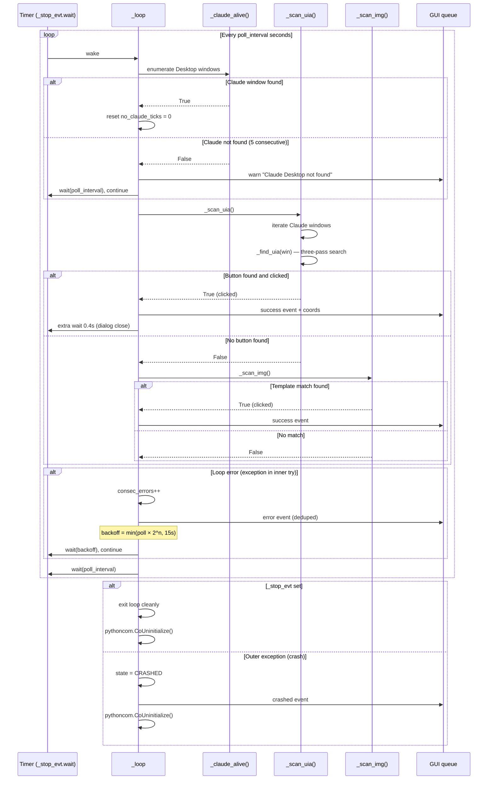
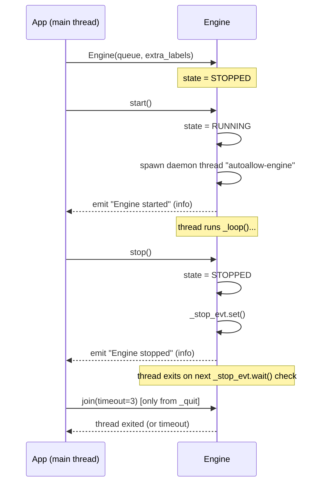

# Engine Poll Flow

## Main loop (`_loop`)

```mermaid
sequenceDiagram
    participant T as Timer (_stop_evt.wait)
    participant L as _loop
    participant CA as _claude_alive()
    participant UIA as _scan_uia()
    participant IMG as _scan_img()
    participant GUI as GUI queue

    loop Every poll_interval seconds
        T->>L: wake

        L->>CA: enumerate Desktop windows
        alt Claude window found
            CA-->>L: True
            L->>L: reset no_claude_ticks = 0
        else Claude not found (5 consecutive)
            CA-->>L: False
            L->>GUI: warn "Claude Desktop not found"
            L->>T: wait(poll_interval), continue
        end

        L->>UIA: _scan_uia()
        UIA->>UIA: iterate Claude windows
        UIA->>UIA: _find_uia(win) — three-pass search

        alt Button found and clicked
            UIA-->>L: True (clicked)
            L->>GUI: success event + coords
            L->>T: extra wait 0.4s (dialog close)
        else No button found
            UIA-->>L: False
            L->>IMG: _scan_img()
            alt Template match found
                IMG-->>L: True (clicked)
                L->>GUI: success event
            else No match
                IMG-->>L: False
            end
        end

        alt Loop error (exception in inner try)
            L->>L: consec_errors++
            L->>GUI: error event (deduped)
            Note over L: backoff = min(poll × 2^n, 15s)
            L->>T: wait(backoff), continue
        end

        L->>T: wait(poll_interval)
    end

    alt _stop_evt set
        L->>L: exit loop cleanly
        L->>L: pythoncom.CoUninitialize()
    else Outer exception (crash)
        L->>L: state = CRASHED
        L->>GUI: crashed event
        L->>L: pythoncom.CoUninitialize()
    end
```

## Startup and shutdown

```mermaid
sequenceDiagram
    participant GUI as App (main thread)
    participant ENG as Engine

    GUI->>ENG: Engine(queue, extra_labels)
    Note over ENG: state = STOPPED

    GUI->>ENG: start()
    ENG->>ENG: state = RUNNING
    ENG->>ENG: spawn daemon thread "autoallow-engine"
    ENG-->>GUI: emit "Engine started" (info)

    Note over ENG: thread runs _loop()...

    GUI->>ENG: stop()
    ENG->>ENG: state = STOPPED
    ENG->>ENG: _stop_evt.set()
    ENG-->>GUI: emit "Engine stopped" (info)
    Note over ENG: thread exits on next _stop_evt.wait() check

    GUI->>ENG: join(timeout=3) [only from _quit]
    ENG-->>GUI: thread exited (or timeout)
```
