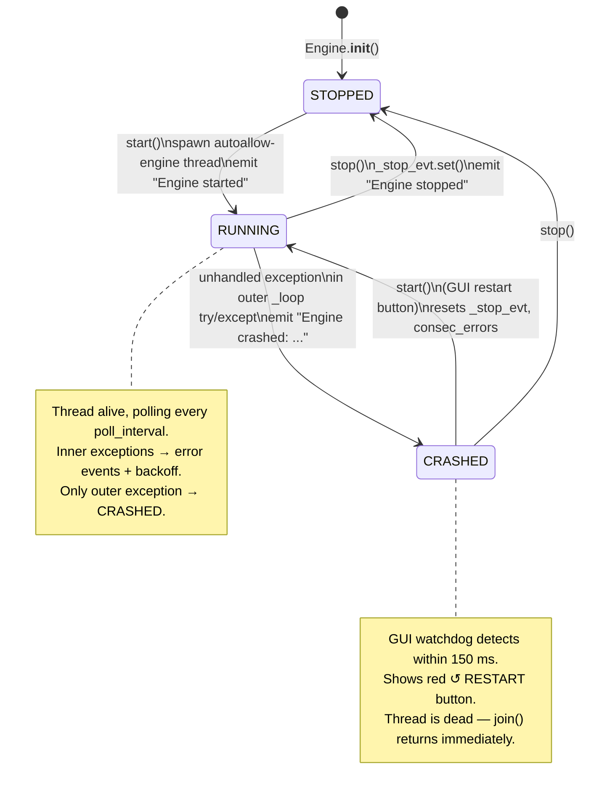
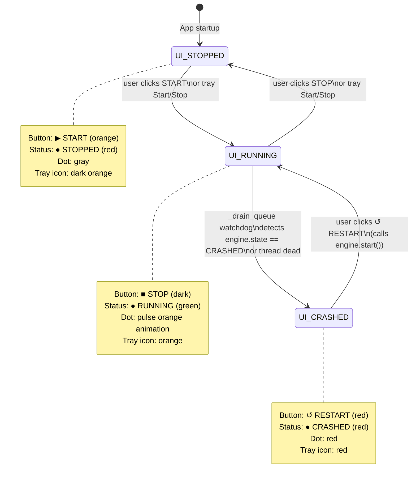
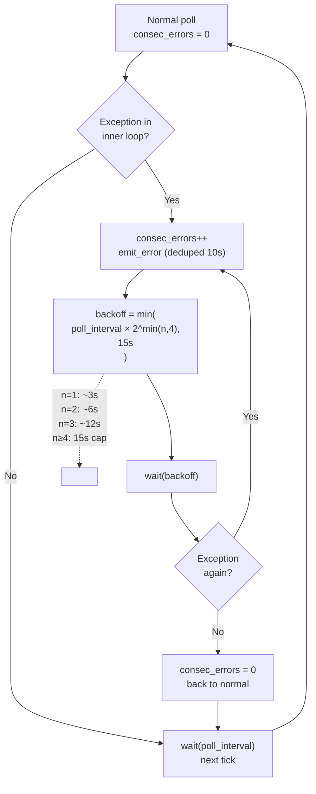

# Engine State Machine

## Engine thread states

```mermaid
stateDiagram-v2
    [*] --> STOPPED : Engine.__init__()

    STOPPED --> RUNNING : start()\nspawn autoallow-engine thread\nemit "Engine started"

    RUNNING --> STOPPED : stop()\n_stop_evt.set()\nemit "Engine stopped"

    RUNNING --> CRASHED : unhandled exception\nin outer _loop try/except\nemit "Engine crashed: ..."

    CRASHED --> RUNNING : start()\n(GUI restart button)\nresets _stop_evt, consec_errors

    CRASHED --> STOPPED : stop()

    note right of RUNNING
        Thread alive, polling every poll_interval.
        Inner exceptions → error events + backoff.
        Only outer exception → CRASHED.
    end note

    note right of CRASHED
        GUI watchdog detects within 150 ms.
        Shows red ↺ RESTART button.
        Thread is dead — join() returns immediately.
    end note
```

## GUI UI states (driven by engine state)

```mermaid
stateDiagram-v2
    [*] --> UI_STOPPED : App startup

    UI_STOPPED --> UI_RUNNING : user clicks START\nor tray Start/Stop
    UI_RUNNING --> UI_STOPPED : user clicks STOP\nor tray Start/Stop
    UI_RUNNING --> UI_CRASHED : _drain_queue watchdog\ndetects engine.state == CRASHED\nor thread dead

    UI_CRASHED --> UI_RUNNING : user clicks ↺ RESTART\n(calls engine.start())

    note right of UI_STOPPED
        Button: ▶ START (orange)
        Status: ● STOPPED (red)
        Dot: gray
        Tray icon: dark orange
    end note

    note right of UI_RUNNING
        Button: ■ STOP (dark)
        Status: ● RUNNING (green)
        Dot: pulse orange animation
        Tray icon: orange
    end note

    note right of UI_CRASHED
        Button: ↺ RESTART (red)
        Status: ● CRASHED (red)
        Dot: red
        Tray icon: red
    end note
```

## Error backoff within RUNNING state

```mermaid
flowchart TD
    OK["Normal poll\nconsec_errors = 0"] --> ERR{Exception in\ninner loop?}
    ERR -->|No| WAIT["wait(poll_interval)\nnext tick"]
    WAIT --> OK
    ERR -->|Yes| INC["consec_errors++\nemit_error (deduped 10s)"]
    INC --> BACKOFF["backoff = min(\n  poll_interval × 2^min(n,4),\n  15s\n)"]
    BACKOFF --> BWAIT["wait(backoff)"]
    BWAIT --> ERR2{Exception\nagain?}
    ERR2 -->|No| RESET["consec_errors = 0\nback to normal"]
    RESET --> WAIT
    ERR2 -->|Yes| INC
    BACKOFF -.->|"n=1: ~3s\nn=2: ~6s\nn=3: ~12s\nn≥4: 15s cap"| note1[" "]
```
