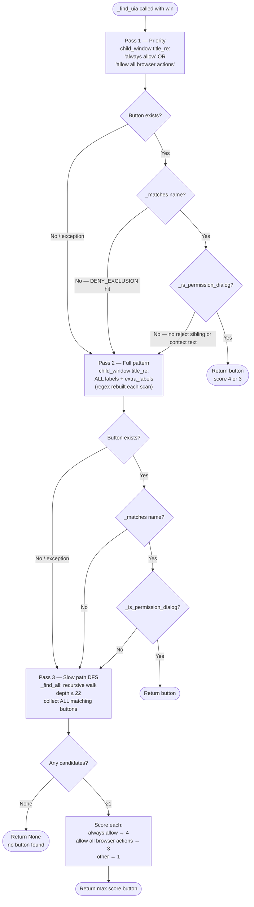
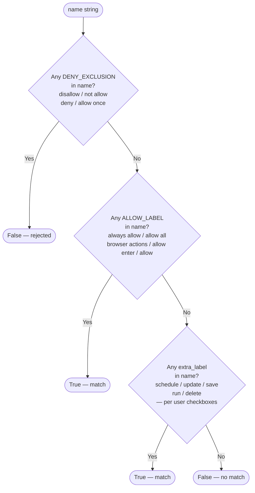
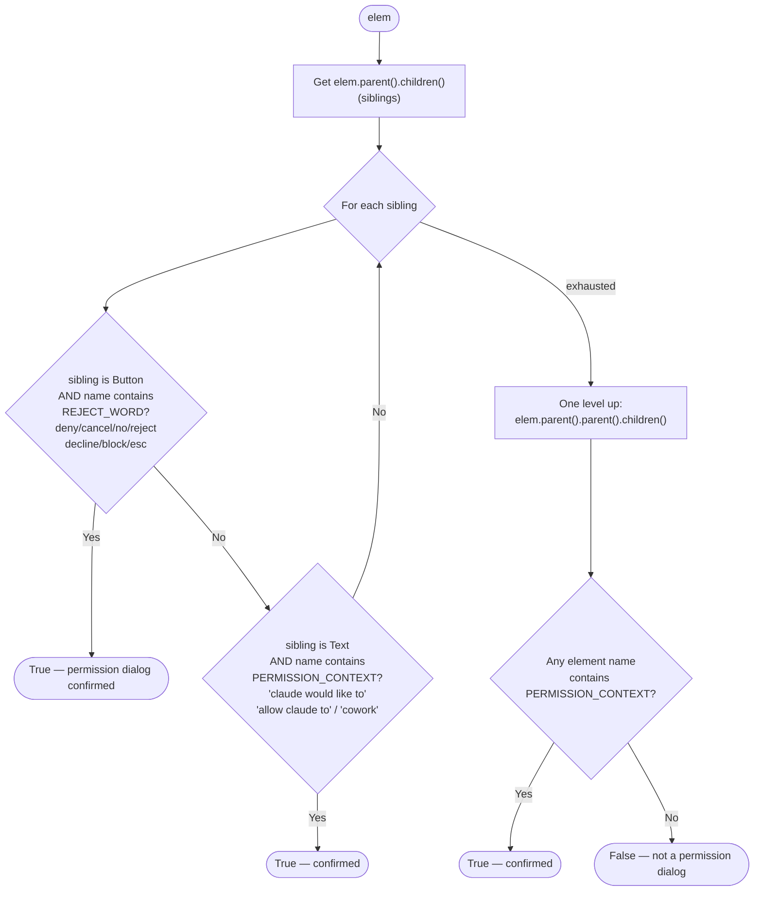

# UIA Button Matching Flow

## Three-pass search (`_find_uia`)

```mermaid
flowchart TD
    START([_find_uia called with win]) --> P1

    P1["Pass 1 — Priority\nchild_window title_re:\n'always allow' OR\n'allow all browser actions'"]
    P1 --> P1_FOUND{Button exists?}
    P1_FOUND -->|No / exception| P2
    P1_FOUND -->|Yes| G1

    G1{_matches name?}
    G1 -->|No — DENY_EXCLUSION hit| P2
    G1 -->|Yes| G2

    G2{_is_permission_dialog?}
    G2 -->|No — no reject sibling or context text| P2
    G2 -->|Yes| RET1([Return button\nscore 4 or 3])

    P2["Pass 2 — Full pattern\nchild_window title_re:\nALL labels + extra_labels\n(regex rebuilt each scan)"]
    P2 --> P2_FOUND{Button exists?}
    P2_FOUND -->|No / exception| P3
    P2_FOUND -->|Yes| G3

    G3{_matches name?}
    G3 -->|No| P3
    G3 -->|Yes| G4

    G4{_is_permission_dialog?}
    G4 -->|No| P3
    G4 -->|Yes| RET2([Return button])

    P3["Pass 3 — Slow path DFS\n_find_all: recursive walk\ndepth ≤ 22\ncollect ALL matching buttons"]
    P3 --> CANDS{Any candidates?}
    CANDS -->|None| NONE([Return None\nno button found])
    CANDS -->|≥1| SCORE["Score each:\nalways allow → 4\nallow all browser actions → 3\nother → 1"]
    SCORE --> RET3([Return max score button])
```

## Guard: `_matches(name)`

```mermaid
flowchart TD
    M_START([name string]) --> DENY{Any DENY_EXCLUSION\nin name?\ndisallow / not allow\ndeny / allow once}
    DENY -->|Yes| DENY_OUT([False — rejected])
    DENY -->|No| ALLOW{Any ALLOW_LABEL\nin name?\nalways allow / allow all\nbrowser actions / allow enter / allow}
    ALLOW -->|Yes| ALLOW_OUT([True — match])
    ALLOW -->|No| EXTRA{Any extra_label\nin name?\nschedule / update / save\nrun / delete\n— per user checkboxes}
    EXTRA -->|Yes| EXTRA_OUT([True — match])
    EXTRA -->|No| NO_OUT([False — no match])
```

## Guard: `_is_permission_dialog(elem)`

```mermaid
flowchart TD
    PD_START([elem]) --> SIB["Get elem.parent().children()\n(siblings)"]
    SIB --> SIB_LOOP{For each sibling}
    SIB_LOOP --> CHK1{sibling is Button\nAND name contains\nREJECT_WORD?\ndeny/cancel/no/reject\ndecline/block/esc}
    CHK1 -->|Yes| TRUE1([True — permission dialog confirmed])
    CHK1 -->|No| CHK2{sibling is Text\nAND name contains\nPERMISSION_CONTEXT?\n'claude would like to'\n'allow claude to' / 'cowork'}
    CHK2 -->|Yes| TRUE2([True — confirmed])
    CHK2 -->|No| SIB_LOOP
    SIB_LOOP -->|exhausted| UP["One level up:\nelem.parent().parent().children()"]
    UP --> CHK3{Any element name\ncontains PERMISSION_CONTEXT?}
    CHK3 -->|Yes| TRUE3([True — confirmed])
    CHK3 -->|No| FALSE_OUT([False — not a permission dialog])
```
