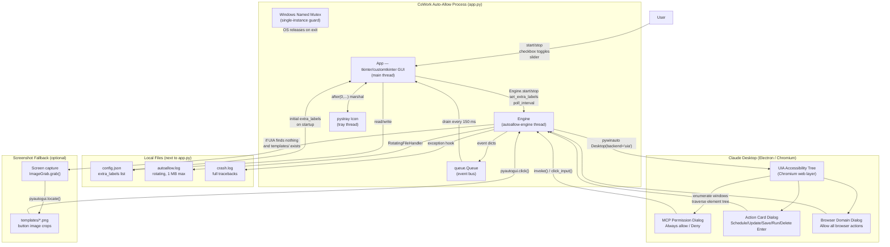
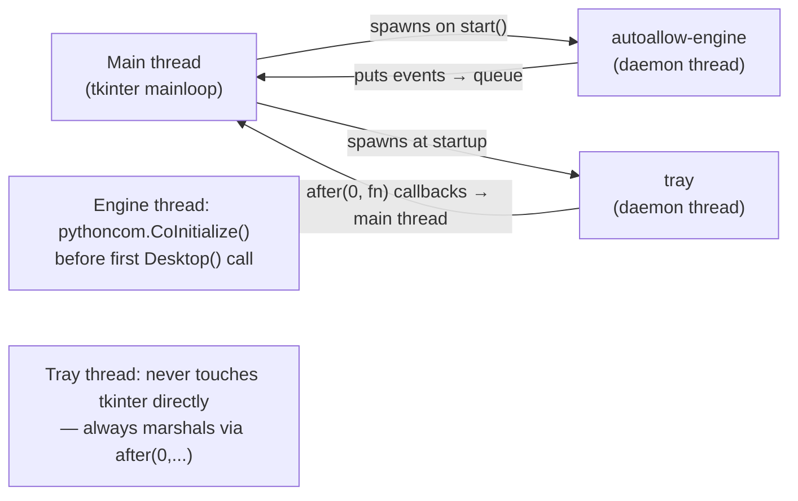

# System Overview

## Components and data flow

```mermaid
graph TB
    subgraph Process["CoWork Auto-Allow Process (app.py)"]
        GUI["App — tkinter/customtkinter GUI\n(main thread)"]
        ENG["Engine\n(autoallow-engine thread)"]
        TRAY["pystray Icon\n(tray thread)"]
        Q["queue.Queue\n(event bus)"]
        MUTEX["Windows Named Mutex\n(single-instance guard)"]
    end

    subgraph Storage["Local Files (next to app.py)"]
        CFG["config.json\nextra_labels list"]
        LOG["autoallow.log\nrotating, 1 MB max"]
        CRASH["crash.log\nfull tracebacks"]
    end

    subgraph Target["Claude Desktop (Electron / Chromium)"]
        UIA_TREE["UIA Accessibility Tree\n(Chromium web layer)"]
        DIALOG_MCP["MCP Permission Dialog\nAlways allow / Deny"]
        DIALOG_ACTION["Action Card Dialog\nSchedule/Update/Save/Run/Delete Enter"]
        DIALOG_BROWSER["Browser Domain Dialog\nAllow all browser actions"]
    end

    subgraph Fallback["Screenshot Fallback (optional)"]
        TMPL["templates/*.png\nbutton image crops"]
        SCREEN["Screen capture\nImageGrab.grab()"]
    end

    USER["User"] -->|"start/stop\ncheckbox toggles\nslider"| GUI
    GUI -->|"Engine.start/stop\nset_extra_labels\npoll_interval"| ENG
    GUI <-->|"after(0,...) marshal"| TRAY
    ENG -->|"event dicts"| Q
    Q -->|"drain every 150 ms"| GUI
    GUI -->|"read/write"| CFG
    CFG -->|"initial extra_labels\non startup"| GUI

    ENG -->|"pywinauto Desktop(backend='uia')"| UIA_TREE
    UIA_TREE -->|"enumerate windows\ntraverse element tree"| DIALOG_MCP
    UIA_TREE --> DIALOG_ACTION
    UIA_TREE --> DIALOG_BROWSER
    DIALOG_MCP -->|"invoke() / click_input()"| ENG
    DIALOG_ACTION --> ENG
    DIALOG_BROWSER --> ENG

    ENG -->|"if UIA finds nothing\nand templates/ exists"| SCREEN
    SCREEN -->|"pyautogui.locate()"| TMPL
    TMPL -->|"pyautogui.click()"| ENG

    ENG -->|"RotatingFileHandler"| LOG
    ENG -->|"exception hook"| CRASH
    MUTEX -->|"held by process\nOS releases on exit"| Process
```

## Thread model

```mermaid
graph LR
    MT["Main thread\n(tkinter mainloop)"]
    ET["autoallow-engine\n(daemon thread)"]
    TT["tray\n(daemon thread)"]

    MT -->|"spawns on start()"| ET
    MT -->|"spawns at startup"| TT
    ET -->|"puts events → queue"| MT
    TT -->|"after(0, fn) callbacks → main thread"| MT

    note1["Engine thread: pythoncom.CoInitialize()\nbefore first Desktop() call"]
    note2["Tray thread: never touches tkinter directly\n— always marshals via after(0,...)"]
```
